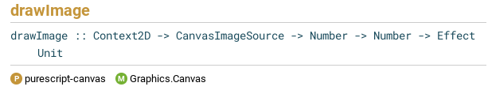

[Introduction](./Introduction.md) | [Chapter 1. The basics.](./Chapter1.md) | [Chapter 2. HTML properties.](./Chapter2.md) | [Chapter 3. Events.](./Chapter3.md) | [Chapter 4. Basic data storage.](./Chapter4.md) | [Chapter 5. Canvas and images.](./Chapter5.md)
# Purescript web programming basics tutorial: Halogen versus purescript HTML.
# Chapter 5 - Canvas and images.
In this part we will cover the html canvas object type and how to add an image to your page. 

We will introduce several 'new' concepts: 
- the HTML canvas object, 
- altering such an object by adding color and an image, 
- the properties of a mouse event, and
- throwing an exception.

## HTML canvas object.
It is quite easy to create a canvas element that will be recognized as such by the browser. This is just a matter of using the \<canvas> tag. However, an element created with this tag is not of the CanvasElement type for purescript. One easy way to get this element as a CanvasElement type is by using the 'getCanvasElementById' (```getCanvasElementById :: String -> Effect (Maybe CanvasElement)```) function from the Graphics.Canvas module (https://pursuit.purescript.org/packages/purescript-canvas/6.0.0/docs/Graphics.Canvas). This is why, in the following code, we first create a canvas element with an Id, and, after that, create a new reference to it of the CanvasElement type. This is the same approach as used in the Purescript by Example book (https://book.purescript.org/chapter12.html?highlight=canvas#simple-shapes). And, just as in the book, in our code below we obtain a CanvasElement from a Maybe CanvasElement using: ```let canvasSure = unsafePartial fromJust canvas```. This is a rather blunt way to handle the Maybe monad, but as we just created the element ourselves, we just assume it will be fine. ("Don't do this at home, kids!")

Those of you familiar with javascript will be used to the fact that you do not use the canvas directly but the '2D graphics context'. If you are not familiar with this, we recommend this tutorial: https://www.w3schools.com/graphics/canvas_intro.asp. Purescript canvas handling stays quite close to its javascript counterpart, and the Purescript by Example book (https://book.purescript.org/chapter12.html?highlight=canvas#simple-shapes) gives some examples you could try in: https://try.purescript.org/, using our code in Fig. 5.1 below.

## Adding an image, and throwing exceptions.
To obtain an image, we use the tryLoadImage function (```tryLoadImage :: String -> (Maybe CanvasImageSource -> Effect Unit) -> Effect Unit```) from the Graphics.Canvas module (https://pursuit.purescript.org/search?q=tryloadimage) in our withImage function. Because the image loading may fail, we check the image loading success, and throw an exception in case of failure. In case of success, we add the image with the drawImage function (```drawImage :: Context2D -> CanvasImageSource -> Number -> Number -> Effect Unit```) from the same module (https://pursuit.purescript.org/search?q=drawimage).

## Mouse event properties.
In Chapter 3 we obtained the value of an input event in Fig. 3.1. We may also obtain information from other events. Like always in purescript, we need to cast the event type to a suitable event type before we can do so. This is what happens in our 'turnEventIntoMaybeMouseEvent' function in Fig. 5.1 below.

```
module Main  where

import Prelude


import Data.Maybe (Maybe(..), fromJust)
import Effect (Effect)
import Effect.Exception (throwException, error)
import Graphics.Canvas (drawImage, fillPath, getCanvasElementById, getContext2D, rect, setCanvasHeight, setCanvasWidth, setFillStyle, tryLoadImage, CanvasImageSource)
import Partial.Unsafe (unsafePartial)
import Web.DOM.Document (Document, createElement)
import Web.DOM.Element (Element, setId, toEventTarget, toNode)
import Web.DOM.Node (appendChild, setTextContent)
import Web.DOM.ParentNode (querySelector, QuerySelector(QuerySelector))
import Web.Event.Event (EventType(EventType), Event)
import Web.Event.EventTarget (EventListener, addEventListener, eventListener)
import Web.HTML (window)
import Web.HTML.HTMLDocument as HTMLDoc
import Web.HTML.Window (document)
import Web.UIEvent.MouseEvent as UIMouse


---------------------------------------------------------------------------
-- The part below is the same as before

-- Take the document ('doc') itself and select from this document an element (division) by its id.
-- This division will be the target element for any changes.
-- Parameters: 
-- doc - the (HTML) document to be manipulated
-- divId - a String representing the HTML id of the division of element.
selectDivTargetFromDocument :: String -> HTMLDoc.HTMLDocument -> Effect (Maybe Element)
selectDivTargetFromDocument divId doc = querySelector (QuerySelector (divId)) (HTMLDoc.toParentNode doc)

-- Create an element with an HTML tag type and contents.
-- Parameters:
-- tag - the HTML tag type, e.g. 'div' or 'button'.
-- contents - the text content of the element as string.
-- nonHTMLdoc - the (nonHTML)document itself.
createElementWithTagAndContent ∷ String → String → Document -> Effect Element
createElementWithTagAndContent tag contents nonHTMLdoc = do
  -- Create the new element
  createdElement <- createElement tag nonHTMLdoc
  -- Add its contents (no return needed, hence the anonymous function '_'.)
  _ <- setTextContent contents (toNode createdElement)
  pure createdElement

-- Append a child if a parent element is given.
-- The function appendChild from Web.DOM.Node takes nodes as arguments 
-- (appendChild :: Node → Node → Effect Unit), so the elements need to be
-- converted to nodes with toNode from Web.DOM.Element.
maybeAppendChildNode ∷ Maybe Element → Element → Effect Unit
maybeAppendChildNode (Just parent1) child1 = appendChild (toNode child1) (toNode parent1)
maybeAppendChildNode _ _ = pure unit

-- Add an eventListener, if an element is provided.
-- Parameters:
-- eh - the EventListener to be used.
-- el - the element to be equipped with the listener.
maybeAddEventListener ∷ EventListener → Maybe Element → Effect Unit
maybeAddEventListener eh (Just el) = addEventListener inputEvent eh true (toEventTarget el)
maybeAddEventListener _ _ = pure unit

-- Take a string and replace the content of an element with this string. If there is no element, do nothing.
-- Parameters:
-- str - the string representing the new content of the element
-- el - the element to be altered
updateText :: String -> Maybe Element -> Effect Unit
updateText str (Just el) = setTextContent str (toNode el)
updateText _ _ = pure unit

---------------------------------------------------------------------------
-- ** The code above is the same as before, except for some imports **
-- Next, we introduce some new functions to handle the input event and its input.

--Define the EventType. In this case: "mousemove". This is a new type.
inputEvent :: EventType
inputEvent = EventType ("mousemove")

-- We need an event handler that responds to the mouse (event).
-- In this case one that writes the mouse coordinates to the output element.
mouseEventHandler ∷ Maybe Element → Event → Effect Unit
mouseEventHandler el evt = do
  updateText ((show $ eventToMouseXCoordinate evt) <> ", " <> (show $ eventToMouseYCoordinate evt)) el

-- We can get the x coordinate from an event, but it must be a 'MouseEvent'.
maybeGetMouseXCoordinate ∷ Maybe UIMouse.MouseEvent → Int
maybeGetMouseXCoordinate (Just mEvt) = UIMouse.clientX mEvt
maybeGetMouseXCoordinate _           = 0  -- Give '0' if it fails.

-- We can get the y coordinate in the same way.
maybeGetMouseYCoordinate ∷ Maybe UIMouse.MouseEvent → Int
maybeGetMouseYCoordinate (Just mEvt) = UIMouse.clientY mEvt
maybeGetMouseYCoordinate _           = 0  -- Give '0' if it fails.

-- We want to use the event as input.
eventToMouseXCoordinate ∷ Event → Int
eventToMouseXCoordinate evt = maybeGetMouseXCoordinate $ turnEventIntoMaybeMouseEvent evt

eventToMouseYCoordinate ∷ Event → Int
eventToMouseYCoordinate evt = maybeGetMouseYCoordinate $ turnEventIntoMaybeMouseEvent evt

-- But now we still need to cast the Event to a MouseEvent.
turnEventIntoMaybeMouseEvent ∷ Event → Maybe UIMouse.MouseEvent
turnEventIntoMaybeMouseEvent evt = do
  mEvt <- UIMouse.fromEvent evt 
  pure mEvt

-- Try to add an image to a canvas, and throw an exception if this fails.
-- Parameters:
-- path - the url of the image.
withImage ∷ String → (CanvasImageSource → Effect Unit) → Effect Unit
withImage path f = tryLoadImage path $ \mimg -> case mimg of
  Just img -> f img
  Nothing -> throwException $ error ("Could not load image from path: " <> path)


main :: Effect Unit
main = do
---------------------------------------------------------------------------
-- Again, we use the same code to start:

   -- Get the body element and the (nonHTML)document
  bodyEl <- selectDivTargetFromDocument "body" =<< document =<< window
  nonHTMLdoc <- HTMLDoc.toDocument <$> (document =<< window)

---------------------------------------------------------------------------
-- *** The code for main above is the same as before. **
  -- As before, we will use a separate, new 'main' division instead of the body 
  -- as the container for our other divisions.
  mainDivElement <- createElementWithTagAndContent "div" "" nonHTMLdoc
  -- And add the created element to the body.
  maybeAppendChildNode bodyEl mainDivElement 

  -- First we create an element of type "div" with text.
  outputElement <- createElementWithTagAndContent "div" "This text will change, when the mouse is moved over the canvas." nonHTMLdoc
  -- And add the created element to the new 'main' division.
  maybeAppendChildNode (Just mainDivElement) outputElement

  -- Then we create an element of type "canvas".
  canvasTargetElement <- createElementWithTagAndContent "canvas" "canvas" nonHTMLdoc
  -- And set its id. (The easiest way to get the CanvasElement type is by using
  -- 'getCanvasElementById'. That's why we add an 'id'.)
  _ <- setId "canvas" canvasTargetElement
  -- And add the created element to the new 'main' division.
  maybeAppendChildNode (Just mainDivElement) canvasTargetElement

  -- Now we will add the image, and demonstrate 'filling' part of the canvas.
  -- First we get the canvas as CanvasElement.
  canvas <- getCanvasElementById "canvas"
  -- We need a CanvasElement, but we got a Maybe CanvasElement. Because we are sure of the
  -- element, we use an unsafe partial function, for now.
  let canvasSure = unsafePartial fromJust canvas
  -- Now we have a CanvasElement, we set the width and Height of the canvas.
  _ <- setCanvasHeight canvasSure 500.0
  _ <- setCanvasWidth canvasSure 500.0
  
  -- Get the '2D context' - Note: You have to create and append the canvas first.
  ctx <- getContext2D canvasSure
  
  -- Now we have the canvas, we add some color.
  setFillStyle ctx "#00F"
  fillPath ctx $ rect ctx
    { x: 0.0
    , y: 0.0
    , width: 400.0
    , height: 150.0
    }  

  -- and add an image:
  withImage "https://shop.fsf.org/sites/default/files/styles/medium/public/2022-shirt-gnu-head-storm-sunglasses.png" $ (\context src -> drawImage context src 0.0 0.0) ctx 

  -- And, finally, add the event listener
  eh <- eventListener (mouseEventHandler $ Just outputElement)
  maybeAddEventListener eh $ Just canvasTargetElement
```
**Figure 5.1: Listing of code to create a canvas element with color and an image.**


## Purescript and its documentation.

This may be a good time to warn you about the learning curve for purescript. The pursuit documentation (https://pursuit.purescript.org/) about the drawImage function, which we used in Fig. 5.1, is just this:



**Figure 5.2: The information on the drawImage function in Pursuit.**

It is up to the reader to figure out what the numbers are. In this case it are just the x and y offsets for the image, but the lack of explanation of parameters and lack of examples is typical of purescript.

## The end
This chapter concludes our tutorial. You now have many tools to build a web page, even without Halogen. If you choose to continue with the Halogen Guide, you will have a lot of background information that, we hope, will help you with a better understanding.

We wish you lots of fun with purescript!